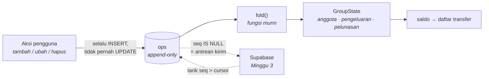

# Patungan

Aplikasi mobile untuk mencatat pengeluaran bersama anak kos dan kelompok tugas,
lalu menghitung siapa harus transfer ke siapa — **tanpa perlu sinyal**, dan tanpa
mengharuskan orang lain memasang aplikasinya.

React Native (Expo) · TypeScript · SQLite · Supabase _(sinkronisasi, Minggu 3)_

> **Status: Minggu 1 selesai.** Aplikasi sudah bisa dipakai sehari-hari, sepenuhnya
> offline: buat grup, catat pengeluaran, lihat saldo, dan selesaikan utang.
> README ini hanya menjelaskan yang sudah benar-benar ada di dalam kode.

---

## Masalah yang dikerjakan

Enam orang di satu kos. Yang satu menalangi galon, yang lain bayar wifi, yang lain
lagi mentraktir makan malam. Sebulan kemudian tidak ada yang ingat siapa berutang
kepada siapa, dan penyelesaiannya berakhir jadi perdebatan panjang di grup WhatsApp
yang tidak pernah benar-benar selesai.

Yang membuatnya tidak sesederhana "catat saja di Notes":

1. **Sinyal tidak selalu ada.** Saat patungan makan, saat itu juga catatannya harus
   masuk. Aplikasi yang butuh internet untuk menyimpan akan ditinggalkan setelah
   dua kali gagal.
2. **Tidak semua orang mau memasang aplikasi.** Kalau catatan baru berguna setelah
   enam orang mendaftar, aplikasinya mati sebelum dipakai.
3. **Rupiah tidak boleh bocor.** Rp 10.000 dibagi tiga adalah 3.333,33 per orang.
   Pembulatan yang ceroboh membuat saldo pelan-pelan melenceng, dan begitu saldo
   tidak lagi berjumlah nol, seluruh perhitungan "siapa transfer ke siapa" jadi
   tidak bisa dipercaya.

---

## Tiga keputusan teknis

### 1. Yang disinkronkan adalah operasi, bukan baris tabel

Basis data lokal aplikasi ini **hanya punya satu tabel isi: `ops`.** Tidak ada tabel
`expenses`, `members`, atau `settlements` yang disimpan. Semua daftar dan saldo yang
tampil di layar dihitung ulang dengan melipat (_fold_) log operasi.



Kenapa bukan menyinkronkan baris seperti umumnya? Karena dua HP yang mengubah
pengeluaran yang sama saat offline akan bertabrakan, dan pemenangnya harus dipilih
tanpa tahu apa yang sebenarnya terjadi. Dengan operasi, tidak ada yang bertabrakan:
keduanya benar, keduanya tersimpan, dan urutannya ditentukan nomor urut dari server.

Tiga hal ikut jadi gratis:

- **Mode pesawat bukan kasus khusus.** Tidak ada satu pun cabang `if (online)` di
  seluruh kode penulisan — menulis saat offline dan online adalah jalur yang sama.
  Bedanya cuma kapan antrean terkuras.
- **Pengiriman ulang aman.** Id operasi dibuat di HP dan jadi kunci idempotensi:
  operasi yang sama boleh datang berkali-kali, hanya berlaku sekali.
- **Tidak mungkin tidak sinkron.** Tidak ada tabel turunan yang bisa melenceng dari
  log, karena tidak ada tabel turunan yang disimpan.

Ongkosnya: melipat ulang di setiap pembacaan. Satu grup kos berisi ratusan operasi,
dan melipatnya makan waktu di bawah satu milidetik. Kalau suatu saat jumlahnya jadi
puluhan ribu, materialisasi bisa ditambahkan sebagai _cache_ — bukan sebagai sumber
kebenaran.

→ [`src/core/ops.ts`](src/core/ops.ts) · [`src/db/repository.ts`](src/db/repository.ts)

### 2. Pembulatan yang tidak menghilangkan rupiah

Seluruh kode bekerja pada **bilangan bulat rupiah**. Tidak pernah float — `0.1 + 0.2`
bukan `0.3` di IEEE-754, dan galat sekecil itu menumpuk lewat ratusan pembagian.

Pembagian memakai metode **sisa terbesar**: bagi ke bawah dulu, lalu sebarkan sisa
rupiah satu per satu kepada yang bagian pecahannya paling besar. Empat mode
pembagian — rata, nominal, persen, porsi — semuanya melewati satu jalur yang sama.

Satu detail yang tidak terlihat tapi terasa: penerima sisa rupiah ditentukan oleh
_seed_ yang diturunkan dari id pengeluaran. Tanpa itu, orang pertama dalam daftar
akan selalu membayar satu rupiah lebih — tiap hari, selamanya. Dengan itu, sisanya
bergilir, dan tetap deterministik sehingga semua HP menghitung angka yang identik.

**Invarian yang dijaga:** `sum(shares) === total`, untuk setiap mode, selalu.
Diuji dengan 1.600 input acak ber-_seed_, bukan beberapa contoh pilihan.

→ [`src/core/split.ts`](src/core/split.ts)

### 3. Penyederhanaan utang

Saldo tiap orang = yang ia talangi − yang jadi porsinya. Dari situ, algoritma greedy
memasangkan penerima terbesar dengan pembayar terbesar sampai semua lunas. Hasilnya
paling banyak `n−1` transfer, bukan `n(n−1)/2`.

Jujur soal batasnya: mencari jumlah transfer **paling sedikit** itu NP-hard — ia
setara mencari sebanyak mungkin himpunan bagian yang berjumlah nol, varian
subset-sum. Greedy tidak dijamin optimal, tapi selalu menghasilkan penyelesaian yang
benar, hampir selalu optimal pada ukuran nyata (3–10 orang), dan selesai seketika.
Pendekatan yang sama dipakai Splitwise.

Layar penyelesaian menampilkan perbandingannya secara terbuka: berapa transfer kalau
setiap orang membayar langsung kepada yang menalangi, versus berapa sesudah utang
searah dialihkan.

→ [`src/core/settle.ts`](src/core/settle.ts)

---

## Anggota bayangan

Anggota grup **tidak wajib punya akun**. Kamu bisa mencatat "Rian" dan "Dika" hanya
sebagai nama, dan aplikasinya langsung berguna — untukmu sendiri, malam itu juga.
Nanti kalau mereka mau, mereka bergabung lewat kode undangan dan _mengklaim_ baris
yang sudah ada, tanpa satu pun catatan lama yang perlu diubah.

Ini keputusan produk, bukan keputusan teknis, dan justru yang paling menentukan:
aplikasi kolaboratif yang baru berguna setelah semua orang memasangnya biasanya
tidak pernah sampai ke titik itu.

---

## Struktur

```
src/
  core/           fungsi murni, tanpa I/O, tanpa React — di sinilah semua aturannya
    money.ts        rupiah sebagai integer, format & baca
    split.ts        pembagian + alokasi sisa pembulatan
    balance.ts      saldo per anggota
    settle.ts       greedy min-cash-flow
    ops.ts          tipe operasi + fold
    selectors.ts    turunan yang dipakai layar
    __tests__/      uji properti ber-seed untuk invarian perhitungan
  db/             satu-satunya lapisan yang menyentuh SQLite
    migrations.ts   skema (PRAGMA user_version)
    repository.ts   append & fold; tidak ada UPDATE/DELETE pada log
    actions.ts      aksi pengguna → operasi
    live.ts         revisi & kueri reaktif
    __tests__/      diuji terhadap SQLite sungguhan lewat `node:sqlite`
  hooks/
  ui/             tema + komponen
  app/            layar (expo-router)
```

Batas yang dijaga ketat: **`src/core/` tidak mengimpor apa pun dari React, React
Native, atau expo-sqlite.** Itu yang membuat seluruh aturan perhitungan bisa diuji
dalam milidetik tanpa perangkat, emulator, atau basis data.

---

## Menjalankan

```bash
npm install
npm start          # lalu pindai QR dengan Expo Go
npm test           # 75 test
npm run typecheck
```

Dikembangkan di Windows dengan iPhone lewat **Expo Go** — tanpa Mac, tanpa akun
Apple Developer. Untuk teman-teman yang memakai Android, APK dibuat lewat EAS Build.

Dipatok ke **Expo SDK 54**, bukan yang terbaru. Alasannya praktis: Expo Go di
iPhone pengembangnya hanya mendukung sampai SDK 54, dan aplikasi yang tidak bisa
dijalankan di HP sendiri tidak akan pernah dipakai sehari-hari — yang justru
menjadi tolok ukur proyek ini.

---

## Peta jalan

- [x] **Minggu 1** — inti perhitungan + penyimpanan lokal + layar utama, sepenuhnya offline
- [ ] **Minggu 2** — mode pembagian nominal/persen/porsi, ubah pengeluaran, riwayat
- [ ] **Minggu 3** — Supabase: skema, RLS, auth, mesin sinkronisasi, kode undangan
- [ ] **Minggu 4** — poles, APK, dipakai beneran di kos

## Yang sengaja tidak dikerjakan

Ditulis di sini supaya jelas ini keputusan, bukan kelupaan:

- **Foto struk / OCR** — menarik, tapi mengalihkan dari inti masalah
- **Integrasi pembayaran / QRIS** — jauh di luar cakupan, plus urusan kepatuhan
- **Push notification** — Expo Go tidak mendukung remote push; tidak dibangun
  ketergantungan padanya
- **Multi-mata uang, versi web, chat dalam grup, laporan bulanan**
